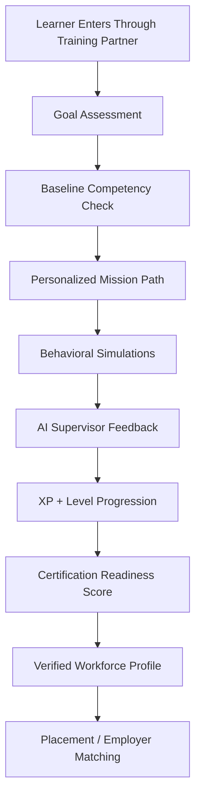
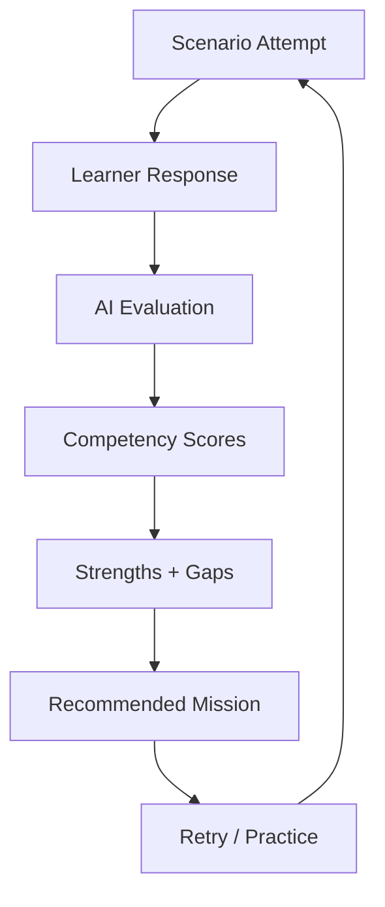
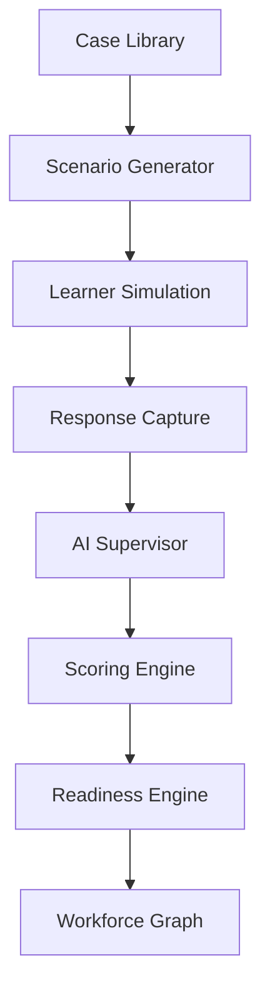
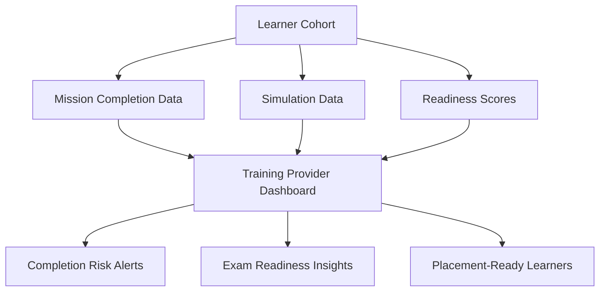
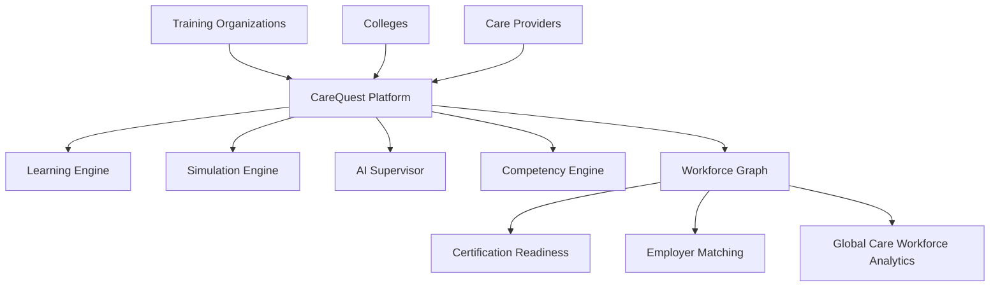

# CareQuest Architecture Diagrams

## 1. Learner Lifecycle

---

## 2. Competency Loop

---

## 3. Simulation Pipeline

---

## 4. Training Provider Dashboard Flow

---

## 5. Long-Term Platform Architecture

